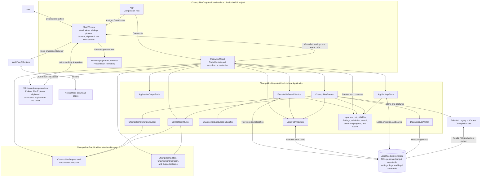

# Unified Component Diagram

## Purpose

This diagram combines the major components used by all GUI features. It expands the GUI container into its UI, Application, and Domain project boundaries while retaining local storage, Windows integrations, WebView2, Nexus Mods, and the external Champollion CLI at the system edge.

## Reading the Diagram

- Arrows represent runtime calls or data flow, not project-reference direction alone.
- `App`, `MainWindow`, and `MainViewModel` form the composition, presentation, and orchestration spine of the desktop process.
- Application services own compatibility, paths, persistence, search, command construction, execution, and diagnostics. DTOs cross between orchestration and those services without owning behavior.
- Domain types carry stable request, option, edition, operation, and game vocabulary without depending on Application or Avalonia.
- The focused [Feature Component Diagrams](components/README.md) expand each workflow with its user trigger, result flow, and relevant external dependencies.